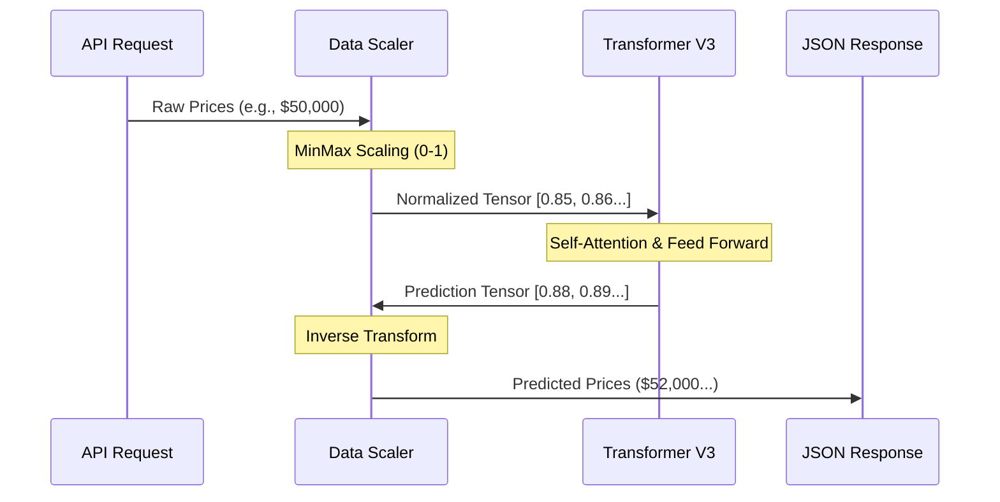

# 🤖 UltronFX AI Model Package


## 📖 Overview
The **Crypto Model Package** is the production artifact store for the UltronFX AI. It contains the serialized knowledge of the system, including the trained Neural Network weights and the data normalization scalers required for inference.

**Path**: `./crypto_model_package/`

---

## 🧠 Model Architecture: Transformer V3

The core model is a custom **Time-Series Transformer** designed specifically for financial forecasting. It adapts the self-attention mechanism to identify complex temporal dependencies in market data.

### Technical Specifications
| Parameter | Value | Description |
| :--- | :--- | :--- |
| **Architecture** | Transformer Encoder | Based on "Attention Is All You Need" (Vaswani et al.). |
| **Input Window** | 72 Days | The model looks back at the last 72 days of data. |
| **Forecast Horizon** | 7 Days | The model predicts the next 7 days of closing prices. |
| **d_model** | 256 | Dimension of the internal vector representation. |
| **n_heads** | 8 | Number of parallel attention heads. |
| **num_layers** | 4 | Number of stacked Transformer encoder layers. |
| **Dropout** | 0.1 | Regularization rate to prevent overfitting. |

---

## 📂 Package Contents

This directory MUST contain the following files for the backend to function:

```text
crypto_model_package/
├── best-v3-seed42_state_dict.pth   # 🧠 The Trained Model Weights (PyTorch)
├── coin_Bitcoin_scaler.pkl         # ⚖️ Scikit-Learn Scaler for Bitcoin
├── coin_Ethereum_scaler.pkl        # ⚖️ Scikit-Learn Scaler for Ethereum
├── ... (other coin scalers)
└── pred_results.json               # 📊 Validation metrics from training
```

> [!IMPORTANT]
> **Do not rename or delete these files.** The `inference.py` script relies on the naming convention `coin_{Name}_scaler.pkl` to dynamically load supported assets.

---

## 🔄 Inference Workflow

How the model turns raw data into a prediction:



---

## 🛠️ Maintenance

### Updating the Model
To deploy a new version of the AI:

1.  **Train** the new model in the `./research/` environment.
2.  **Export** the `state_dict.pth` and all `_scaler.pkl` files.
3.  **Replace** the existing files in this directory.
4.  **Restart** the Backend service.

### Adding New Assets
To add support for a new cryptocurrency (e.g., Solana):
1.  Train the model on Solana data.
2.  Generate `coin_Solana_scaler.pkl`.
3.  Place the file in this directory.
4.  The backend will automatically detect and support `SOL` on the next restart.
