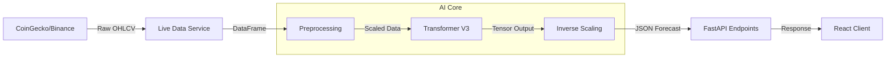

# 🧠 UltronFX Backend


## 📖 Overview
**UltronFX Backend** is the high-performance inference engine and API server for the UltronFX platform. It leverages **FastAPI** for asynchronous request handling and **PyTorch** for running the custom Transformer V3 forecasting model.

---

## 🛠️ Technical Stack

| Category | Technology | Purpose |
| :--- | :--- | :--- |
| **Runtime** | Python 3.10+ | Core language. |
| **API Framework** | FastAPI | High-performance, async web framework. |
| **Server** | Uvicorn | ASGI server implementation. |
| **ML Engine** | PyTorch | Deep learning tensor computation. |
| **Data Processing** | Pandas / NumPy | Time-series manipulation and math. |
| **Auth** | Python-Jose / Passlib | JWT generation and Bcrypt hashing. |

---

## 🔄 Data Pipeline Architecture

The system follows a linear pipeline from data ingestion to inference delivery.



---

## 🔌 API Reference

### Prediction Endpoints
| Method | Endpoint | Description | Auth Required |
| :--- | :--- | :--- | :--- |
| `GET` | `/predict/{coin_name}` | Get 7-day price forecast for a coin. | ✅ Yes |
| `GET` | `/market-overview` | Get aggregated market sentiment & risk scores. | ✅ Yes |

### Authentication
| Method | Endpoint | Description |
| :--- | :--- | :--- |
| `POST` | `/auth/login` | Authenticate user and receive JWT. |
| `POST` | `/auth/signup` | Register a new user account. |

### System
| Method | Endpoint | Description | Auth Required |
| :--- | :--- | :--- | :--- |
| `GET` | `/health` | Check API operational status. | ❌ No |
| `POST` | `/admin/retrain` | Trigger model retraining (Admin only). | ✅ Yes (Admin) |

---

## 🚀 Setup & Installation

### Prerequisites
*   Python 3.10 or higher
*   CUDA Toolkit (optional, for GPU acceleration)

### Installation

1.  **Navigate to backend**
    ```bash
    cd backend
    ```

2.  **Create Virtual Environment**
    ```bash
    python -m venv venv
    source venv/bin/activate  # On Windows: venv\Scripts\activate
    ```

3.  **Install Dependencies**
    ```bash
    pip install -r requirements.txt
    ```

4.  **Run the Server**
    ```bash
    uvicorn app:app --reload --port 8000
    ```
    The API docs will be available at `http://localhost:8000/docs`.

---

## 📂 Project Structure

*   **`app.py`**: Main application entry point.
*   **`model.py`**: PyTorch definition of the Transformer V3 architecture.
*   **`inference.py`**: Logic for loading models and running predictions.
*   **`live_data_service.py`**: Handles external API communication.
*   **`auth.py`**: Security and token management.
*   **`crypto_model_package/`**: **CRITICAL**. Stores trained `.pth` weights and `.pkl` scalers.

---

## 🧪 Testing

Run the included test suite to verify system integrity:

```bash
# Test API endpoints
python verify_api.py

# Test Model Inference
python test_live_predict.py
```
