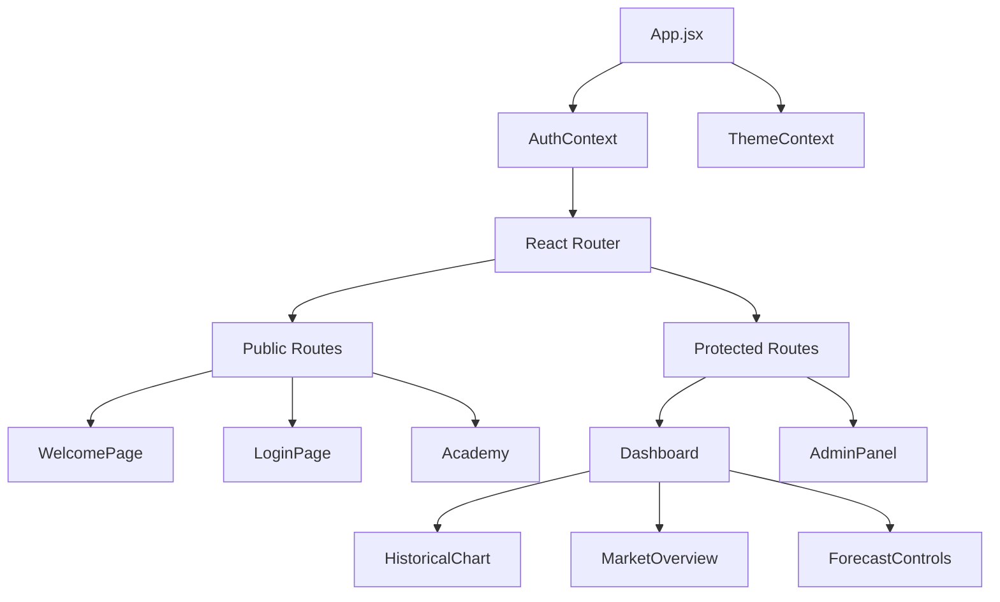

# 🎨 UltronFX Frontend


## 📖 Overview
**UltronFX Frontend** is the client-side interface for the UltronFX AI forecasting platform. Built with a **futuristic, glassmorphic design system**, it provides real-time visualization of financial data, AI predictions, and market sentiment analysis. It is engineered for high performance, responsiveness, and seamless user experience.

---

## 🛠️ Technical Stack

| Category | Technology | Version | Purpose |
| :--- | :--- | :--- | :--- |
| **Core** | [React](https://react.dev/) | `^19.0` | Component-based UI library. |
| **Build System** | [Vite](https://vitejs.dev/) | `^7.0` | Next-generation frontend tooling. |
| **Styling** | [Tailwind CSS](https://tailwindcss.com/) | `^4.0` | Utility-first CSS framework. |
| **Routing** | [React Router](https://reactrouter.com/) | `^7.0` | Client-side routing. |
| **Visualization** | [ApexCharts](https://apexcharts.com/) | `^3.0` | Interactive financial charting. |
| **Icons** | [Lucide React](https://lucide.dev/) | `Latest` | Lightweight SVG icons. |
| **Animation** | [Framer Motion](https://www.framer.com/motion/) | `Latest` | Production-ready animation library. |

---

## 🏗️ Architecture

The application follows a modular, component-driven architecture.



### Key Directories
```text
frontend/
├── src/
│   ├── components/      # Reusable UI atoms & molecules (Cards, Buttons)
│   ├── pages/           # Route-level views (Dashboard, Academy)
│   ├── context/         # Global state (Auth, Theme)
│   ├── hooks/           # Custom React hooks (useFetchData)
│   └── assets/          # Static images and global styles
├── public/              # Public assets (favicon, manifest)
└── package.json         # Dependency definitions
```

---

## 🚀 Getting Started

### Prerequisites
*   **Node.js**: v18.0.0 or higher
*   **npm**: v9.0.0 or higher

### Installation

1.  **Clone the repository**
    ```bash
    git clone https://github.com/yourusername/ultronfx.git
    cd ultronfx/frontend
    ```

2.  **Install Dependencies**
    ```bash
    npm install
    ```

3.  **Start Development Server**
    ```bash
    npm run dev
    ```
    The app will be available at `http://localhost:5173`.

4.  **Build for Production**
    ```bash
    npm run build
    ```

---

## 💎 Design System

The UI implements a custom **"Deep Space"** theme using Tailwind CSS.

*   **Glassmorphism**: Heavy use of `backdrop-blur-md` and `bg-white/10` for depth.
*   **Gradients**: `bg-gradient-to-r from-blue-600 to-purple-600` for primary actions.
*   **Dark Mode**: Native support via `dark:` variant, toggled via `ThemeContext`.

### Core Components
*   **`HistoricalChart.jsx`**: A wrapper around ApexCharts that handles data formatting and theme synchronization.
*   **`MarketOverview.jsx`**: Displays calculated metrics (RSI, MACD) and AI-generated sentiment.
*   **`Academy.jsx`**: A complex, tabbed interface for the educational platform.

---

## 🤝 Contributing

1.  Fork the repository.
2.  Create a feature branch (`git checkout -b feature/AmazingFeature`).
3.  Commit your changes (`git commit -m 'Add some AmazingFeature'`).
4.  Push to the branch (`git push origin feature/AmazingFeature`).
5.  Open a Pull Request.
